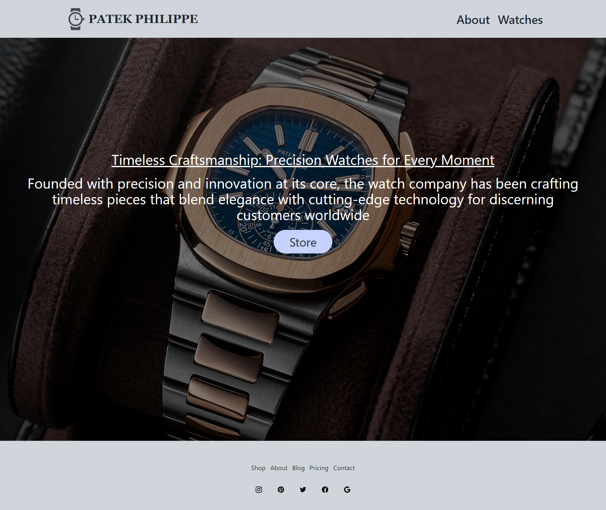

# PATEK (Watches)
## Technologies Used 
 - HTML
 - TAILWIND CSS
 - JAVASCRIPT
 - REACT JS

# HOMEPAGE

# ABOUT

# WATCHES

/admin
/admin/income
/admin/reviews
/admin/watches
/admin/watches/:id
/admin/watches/:id/pricing
/admin/watches/:id/photos

challenges-
create admin link to the navbar that takes you to the /admin path
create the following components in the pages /admin folder
dashboard.js - /admin
income.js    - /admin/income
review.js    - /admin/reviews

these components just can have an h1 for the function name 

setup routes for each of these pages 

What is the primary reason to use a nested route
What is a Layout Route
What does the outlet component do
when do you use it
what is an index route

Add the admin/watches and admin/suv/:id
as well as the watch link in the admin navbar
for now just read the stubbed-out  version of pages
dont worry about adding navigation from admin/watch to admin/watch/:id 
when deciding whether or not to use nested route, keep in mind what will/won't be shared between these 2 pages

building out the  admin watch list and details  pages
